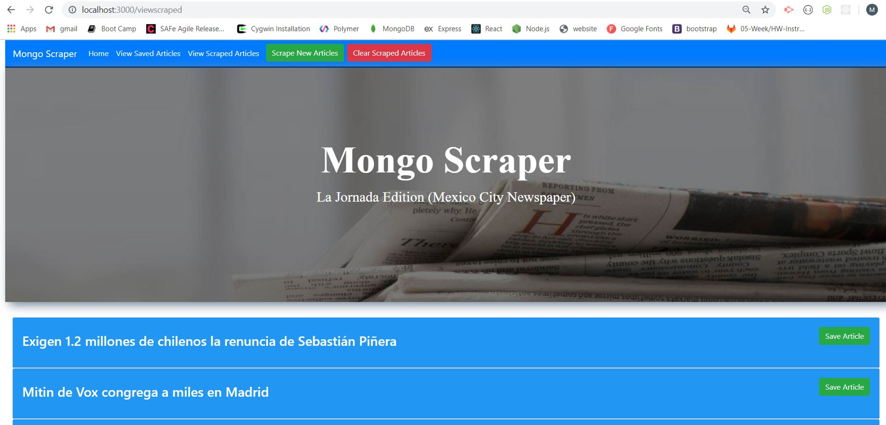

# News Scraper
## News Scraper Using MongoDB, Express, Handlebars and Node

This node.js program scrapes a Mexico City Newspaper and put the data in an ArticleTemp MongoDB collection.  The Scraped Articles can be 
seen by clicking on the View Scraped Articles Menu Item.  In this option you can save articles to another MongoDB collection Article.  Where you then have the option to make a note or delete the article at some later time.
